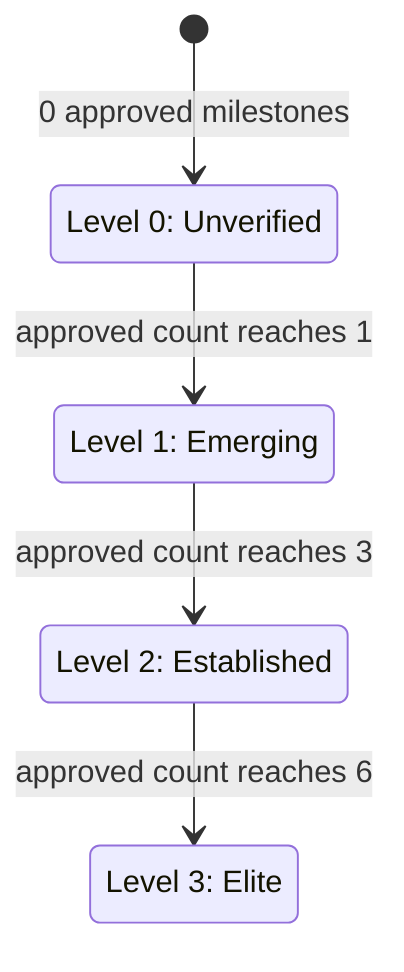

# Player Tier Promotion

Players carry a tier, stored as the integer `progress_level` (0–3) on the
`players` table. A player's tier reflects how many of their submitted milestones
the contract has approved.

## Criteria

Tier is derived **purely from the number of `milestone_approved` events recorded
for the player**. A player holds the highest tier whose minimum-milestone
threshold their approved count meets or exceeds:

| Approved milestones | Tier | Label       |
| ------------------- | ---- | ----------- |
| 0                   | 0    | Unverified  |
| 1–2                 | 1    | Emerging    |
| 3–5                 | 2    | Established |
| 6 or more           | 3    | Elite       |

The thresholds are defined once, as data, in
[`src/services/tierPromotion.ts`](../src/services/tierPromotion.ts)
(`TIER_THRESHOLDS`). The indexer and the tests both consume that single source
of truth, so retuning promotion is a one-line change to the thresholds.

These transitions show the backend promotion model implemented by
`tierForApprovedMilestones`. Product-facing material may describe levels 1 and
2 as "Verified Identity" and "Performance Milestones", but those labels do not
add KYC, academy, footage, or trial-offer conditions to this service. In the
backend, only the recorded `milestone_approved` count controls these transitions.

## When promotion happens

Promotion is applied by the indexer ([`src/services/indexer.ts`](../src/services/indexer.ts))
as it processes events. For every `milestone_approved` event:

1. The event is persisted to the `events` table.
2. The indexer counts the player's total approved milestones
   (`getEvents('milestone_approved')` filtered by `player_id`).
3. `updatePlayerProgress(playerId, tierForApprovedMilestones(count))` writes the
   resulting tier to `players.progress_level`.

Tier is **recomputed from the authoritative event count** rather than trusting a
`progress_level` field on the event payload. Because the `events` table dedups on
`tx_hash` (`INSERT OR IGNORE`), replaying a ledger range is idempotent — a player
can never be double-counted or demoted by a re-index.
